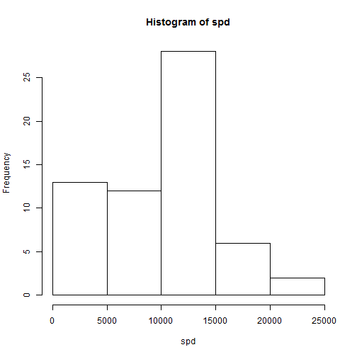
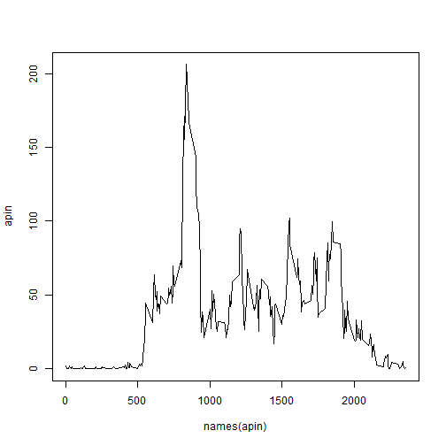
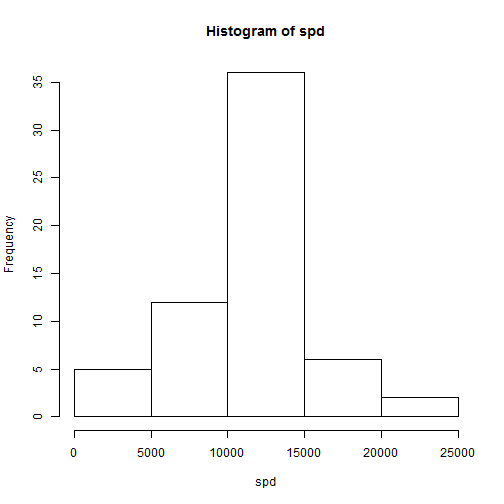
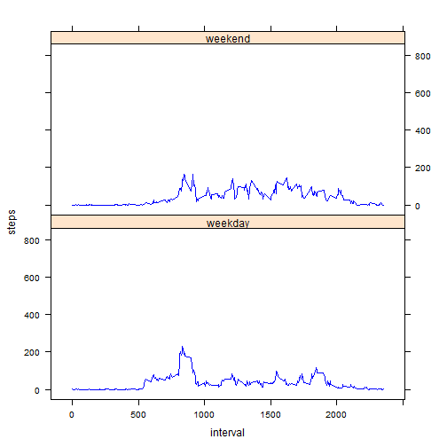

# Reproducible Research: Peer Assessment 1


## Loading and preprocessing the data

```r
rdata <- read.csv("activity.csv")
rdata$date <- as.Date(rdata$date)
```


## What is mean total number of steps taken per day?

```r
gr <- split(rdata, rdata$date)
spd <- sapply(gr, function(x){ sum (x[,1], na.rm = TRUE)})
mnspd <- mean(spd)
mdspd <- median(spd)
hist(spd)
```

 


## What is the average daily activity pattern?

```r
gr <- split(rdata, rdata$interval)
apin <- sapply(gr, function(x){ mean (x[,1], na.rm = TRUE)})
plot(names(apin), apin, type = "l")
```

 
## Imputing missing values

```r
missingvalues <- sum(!complete.cases(rdata))
ndata <- rdata
ndata[!complete.cases(ndata), 1] <- apin[as.character(ndata[!complete.cases(ndata), 3])]
gr <- split(ndata, ndata$date)
spd <- sapply(gr, function(x){ sum (x[,1], na.rm = TRUE)})
mnspd <- mean(spd)
mdspd <- median(spd)
hist(spd)
```

 

## Are there differences in activity patterns between weekdays and weekends?

```r
library(lattice)
wd  <- weekdays(as.Date(ndata$date, ), abbreviate = TRUE)
wd[wd == "Sun" | wd == "Sat"] <- "1"
wd[wd != 1] <- "0"
ndata$wd <- factor(wd, labels = c("weekday", "weekend"), levels = c("0", "1"))
xyplot(steps ~ interval | wd, layout = c(1,2),
       data = ndata,
       panel = function(x, y, ...) {
          panel.average(x, y, horizontal = FALSE, col = "Blue", ... )
       })
```

 
